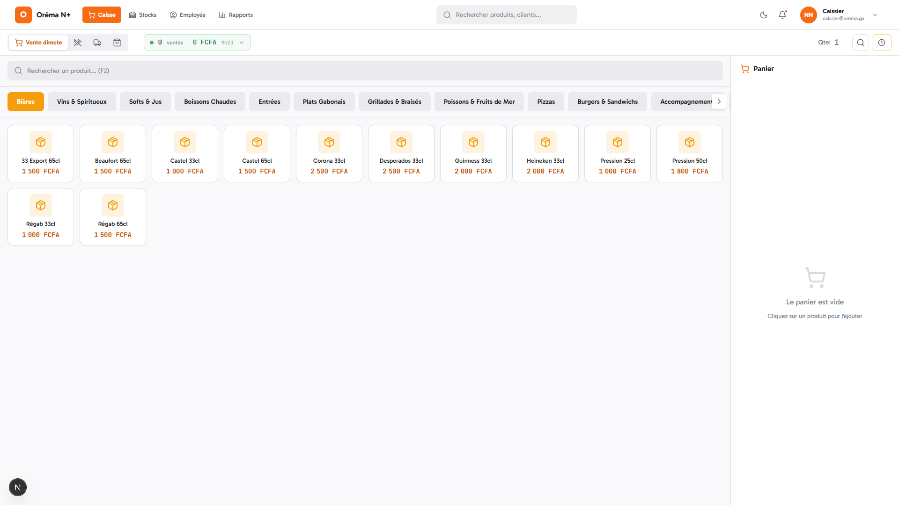
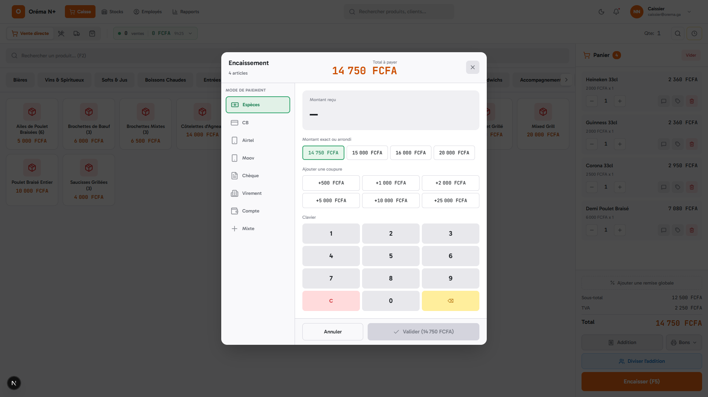
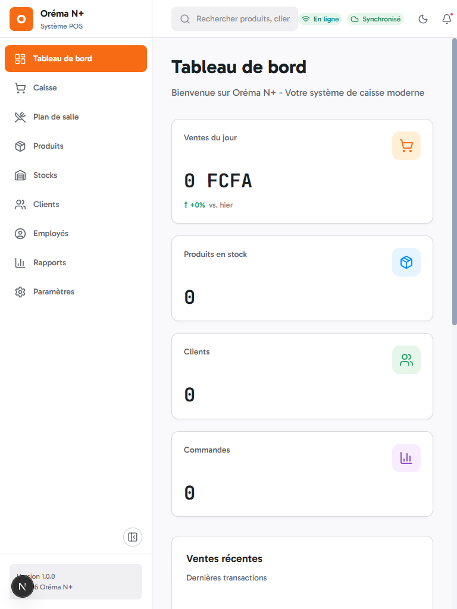

<div align="center">

# Orema N+

**Systeme de Point de Vente moderne pour le marche gabonais et africain**

[](https://nextjs.org/)
[](https://react.dev/)
[](https://www.typescriptlang.org/)
[](https://supabase.com/)
[](LICENSE)

[Fonctionnalites](#fonctionnalites) &bull; [Stack technique](#stack-technique) &bull; [Installation](#installation) &bull; [Screenshots](#screenshots) &bull; [Architecture](#architecture)

</div>

---

## A propos

**Orema N+** (signifiant "le coeur" en langue locale) est un systeme de caisse (POS) complet concu pour les restaurants, brasseries, maquis, bars, fast-foods et commerces du Gabon et d'Afrique centrale.

Le systeme prend en charge les specificites du marche local : devise FCFA (XAF), TVA gabonaise (18%), paiements Mobile Money (Airtel Money, Moov Money), et impression thermique ESC/POS.

## Fonctionnalites

### Module Caisse
- Vente directe, service en salle, livraison, a emporter
- Paiements multiples (especes, carte, Mobile Money, compte client, mixte)
- Impression tickets thermiques et bons de cuisine
- Mode hors-ligne avec synchronisation automatique

### Gestion de salle
- Plan de salle interactif avec drag & drop
- Statut des tables en temps reel
- Transfert de table et division d'addition
- Zones configurables

### Produits & Stocks
- Catalogue avec categories, supplements et produits composites
- Gestion des stocks avec deduction automatique
- Import/export CSV
- Support codes-barres

### Rapports
- Rapport Z (cloture de caisse)
- Statistiques de ventes par periode
- Analyse des produits les plus vendus et heures de pointe
- Export PDF, Excel, CSV

### Administration
- Gestion des employes avec roles (Admin, Manager, Caissier, Serveur)
- Permissions granulaires par role
- Connexion rapide par code PIN
- Journal d'audit des operations sensibles
- Blog et documentation integres

## Screenshots

<div align="center">
<table>
<tr>
<td align="center"><strong>Interface de caisse</strong></td>
<td align="center"><strong>Commande en cours</strong></td>
</tr>
<tr>
<td></td>
<td></td>
</tr>
<tr>
<td align="center"><strong>Encaissement</strong></td>
<td align="center"><strong>Rapports</strong></td>
</tr>
<tr>
<td></td>
<td></td>
</tr>
<tr>
<td align="center"><strong>Mode sombre</strong></td>
<td align="center"><strong>Responsive tablet</strong></td>
</tr>
<tr>
<td></td>
<td></td>
</tr>
</table>
</div>

## Stack technique

| Categorie | Technologies |
|-----------|-------------|
| **Framework** | Next.js 16 (App Router, Turbopack) |
| **UI** | React 19, Radix UI Themes 3, Tailwind CSS 4 |
| **Langage** | TypeScript 5 (strict) |
| **Base de donnees** | PostgreSQL via Supabase |
| **Authentification** | Supabase Auth + PIN codes (hashes) |
| **Etat global** | Zustand 5 |
| **Etat serveur** | TanStack Query 5 |
| **Formulaires** | React Hook Form + Zod |
| **Impression** | ESC/POS (USB, reseau, serie) |
| **Tests** | Vitest (unitaires), Playwright (E2E) |

## Installation

### Prerequis

- Node.js 20+
- pnpm 9+
- Un projet [Supabase](https://supabase.com/) (gratuit)

### Demarrage

```bash
# Cloner le depot
git clone https://github.com/Danel2025/Orema-n-.git
cd Orema-n-

# Installer les dependances
pnpm install

# Configurer les variables d'environnement
cp .env.example .env
# Editer .env avec vos cles Supabase

# Lancer le serveur de developpement
pnpm dev
```

Ouvrir [http://localhost:3000](http://localhost:3000)

### Variables d'environnement

```env
NEXT_PUBLIC_SUPABASE_URL=https://votre-projet.supabase.co
NEXT_PUBLIC_SUPABASE_ANON_KEY=votre-cle-anon
SUPABASE_SERVICE_ROLE_KEY=votre-cle-service
JWT_SECRET=votre-secret-jwt
```

## Scripts

```bash
# Developpement
pnpm dev                  # Serveur dev (Turbopack)
pnpm build                # Build de production
pnpm start                # Serveur de production

# Qualite de code
pnpm lint                 # ESLint
pnpm lint:fix             # Corriger automatiquement
pnpm format               # Prettier

# Tests
pnpm test                 # Tests unitaires (watch)
pnpm test:run             # Tests unitaires (une fois)
pnpm test:e2e             # Tests E2E Playwright

# Base de donnees
pnpm db:types             # Generer les types TypeScript depuis Supabase
```

## Architecture

```
gabon-pos/
├── app/                        # Next.js App Router
│   ├── (auth)/                 #   Login, register, PIN
│   ├── (dashboard)/            #   Routes protegees
│   │   ├── caisse/             #     Interface de caisse
│   │   ├── salle/              #     Plan de salle
│   │   ├── produits/           #     Gestion produits
│   │   ├── stocks/             #     Gestion stocks
│   │   ├── clients/            #     Gestion clients
│   │   ├── employes/           #     Gestion employes
│   │   ├── rapports/           #     Rapports et statistiques
│   │   ├── parametres/         #     Configuration
│   │   └── admin/              #     Administration (blog, docs)
│   ├── (public)/               #   Pages publiques
│   └── api/                    #   API Routes
├── actions/                    # Server Actions (mutations)
├── components/
│   ├── ui/                     #   Composants Radix UI
│   ├── composed/               #   Composants composes
│   ├── caisse/                 #   Composants caisse
│   ├── salle/                  #   Composants plan de salle
│   └── ...                     #   Autres modules
├── lib/
│   ├── db/                     #   Couche base de donnees Supabase
│   ├── auth/                   #   Authentification
│   ├── print/                  #   Impression ESC/POS
│   └── design-system/          #   Utilitaires design
├── stores/                     # Zustand (cart, session, UI)
├── schemas/                    # Schemas Zod
├── types/                      # Types TypeScript
├── supabase/
│   ├── migrations/             #   Migrations SQL
│   └── functions/              #   Edge Functions
└── tests/
    ├── unit/                   #   Tests Vitest
    └── e2e/                    #   Tests Playwright
```

## Configuration metier

| Parametre | Valeur |
|-----------|--------|
| **Devise** | XAF / FCFA (sans decimales) |
| **TVA standard** | 18% |
| **TVA reduite** | 10% |
| **Timezone** | Africa/Libreville |
| **Langue** | Francais |
| **Mobile Money** | Airtel Money, Moov Money |
| **Format ticket** | YYYYMMDD00001 (sequentiel/jour) |

## Roles utilisateurs

| Role | Acces |
|------|-------|
| **Super Admin** | Acces complet, gestion multi-etablissements |
| **Admin** | Configuration etablissement, employes, rapports |
| **Manager** | Produits, stocks, rapports, cloture de caisse |
| **Caissier** | Caisse, encaissements, consultation rapports |
| **Serveur** | Prise de commande, gestion tables |

## Contribuer

1. Fork le projet
2. Creer une branche (`git checkout -b feature/ma-fonctionnalite`)
3. Commit les changements (`git commit -m 'feat: ajouter ma fonctionnalite'`)
4. Push la branche (`git push origin feature/ma-fonctionnalite`)
5. Ouvrir une Pull Request

## Licence

Ce projet est sous licence [MIT](LICENSE).

---

<div align="center">

**Orema N+** — Le coeur de votre commerce

Concu avec soin pour le Gabon et l'Afrique centrale

</div>
